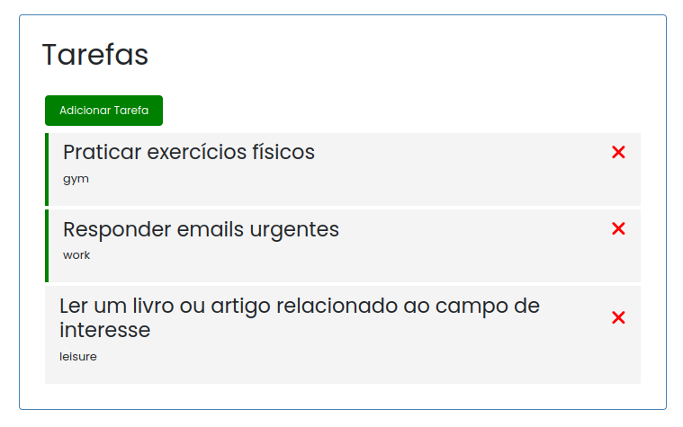
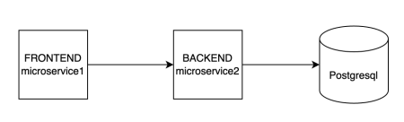

## GCC270 - DevOps na Prática - Trabalho Final: TODO List

Este é o trabalho final da disciplina GCC270 - DevOps na Prática oferecida pela Universidade Federal de Lavras (UFLA). O projeto consiste na criação de uma aplicação de gerenciamento de tarefas (TODO List) utilizando Angular para o frontend, Spring Boot (Java 21) para o backend e PostgreSQL como banco de dados. Além disso, o projeto inclui Docker para a criação de imagens e contêineres, e Kubernetes para orquestração.

## Índice

- [Estrutura do Projeto](#estrutura-do-projeto)
- [Tecnologias Utilizadas](#tecnologias-utilizadas)
- [Endpoints Backend](#endpoints-backend)
- [Estrutura do Frontend](#estrutura-do-frontend)
- [Deploy no Kubernetes](#deploy-no-kubernetes)
- [Licença](#licença)

## Estrutura do Projeto

- Frontend: Desenvolvido com Angular 18.
- Backend: Desenvolvido com Java 21 - Spring Boot.
- Banco de Dados: Utilização do PostgreSQL como banco relacional.

## Tecnologias Utilizadas

- **Java 21**
- **Spring Boot 3**
- **PostgreSQL**
- **Maven**
- **Docker**
- **Kubernetes**

## Endpoints Backend

A API do backend expõe os seguintes endpoints para o gerenciamento das tarefas:

- GET /api/tasks: Retorna todas as tarefas.
- GET /api/tasks/{id}: Retorna uma tarefa pelo ID.
- POST /api/tasks: Cria uma nova tarefa.
- PUT /api/tasks/{id}: Atualiza uma tarefa existente.
- DELETE /api/tasks/{id}: Remove uma tarefa.

## Estrutura do Frontend

A aplicação Angular consome a API REST fornecida pelo backend. Ela permite criar, listar, editar e remover tarefas.
Principais Componentes:

- TaskListComponent: Lista todas as tarefas.
- TaskItemComponent: Renderiza cada tarefa individualmente.
- AddTaskComponent: Formulário para adicionar novas tarefas.
- ButtonComponent: Renderiza botões reutilizáveis no sistema.

## Deploy no Kubernetes

Os manifestos Kubernetes estão localizados na pasta k8s/. Eles incluem:

- Backend Deployment
- Backend Service
- Frontend Deployment
- Frontend Service
- PostgreSQL Deployment
- PostgreSQL PVC
- ConfigMap 
- Secrets 

~~~
kubectl apply -f k8s/
~~~

## Licença

Este projeto está licenciado sob a licença MIT. Veja o arquivo [LICENSE](LICENSE) para mais detalhes.
